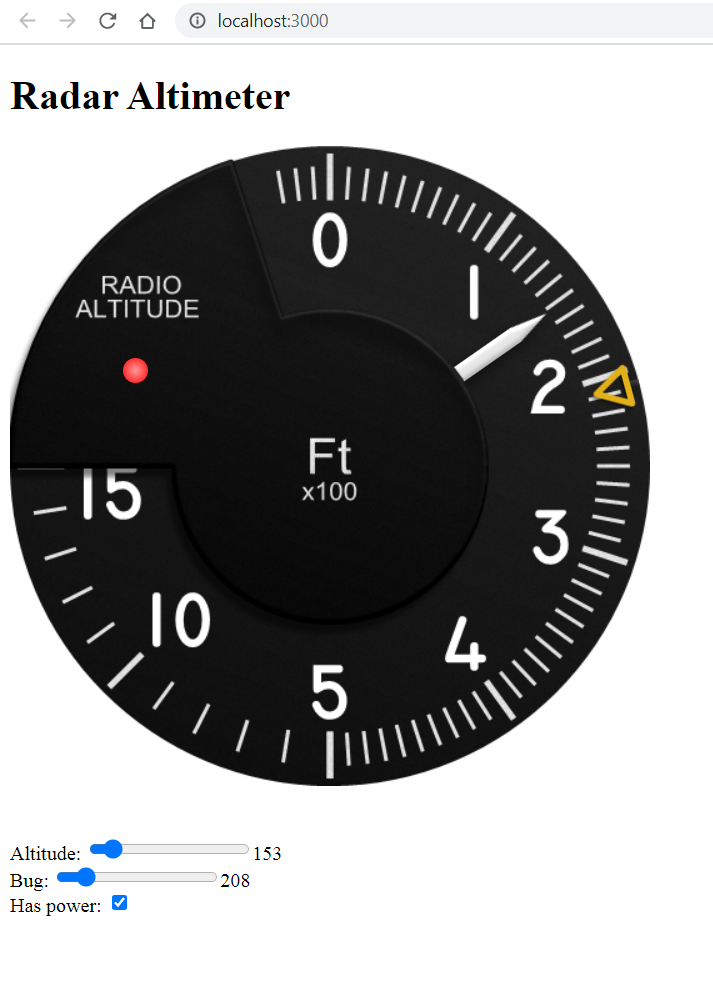

# Radar Altimeter
# _Radar Altimeter using React_

This is a simple radar altimeter using react completed as part of a job application screening. 

## Features
- Two range sliders from 0 to 1500, one for needle and one for bug
- Checkbox to toggle instrument power on and off

### Behaviour
- The needle and bug will be rotated to indicate on the instrument the current value from
the respective slider.
- When the power is off:
    + The flag will appear.
    + The needle remain stuck in the position where it was powered off.
    + The bug can be moved as it is done mechanically.
    + The light turns off.
- The light comes on  when  following conditions are met: 
    + The needle has transitioned from above the bug to below it.
    + The power is on.

## Screenshots
 

## Live Demo
The app is already deployed to Heroku cloud and can be viewed lived at [https://radar-altimeter-react.herokuapp.com/](https://radar-altimeter-react.herokuapp.com "Heroku app link") 

## How to get started
- Install node.js
- Navigate to the project folder in node.js CLI
- Run `npm install` and `npm start`.